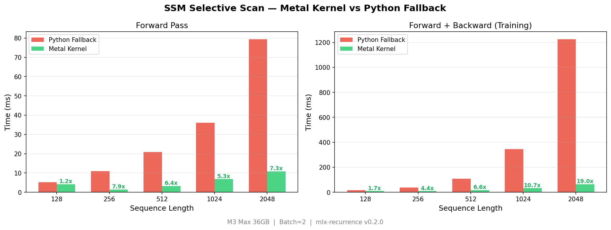
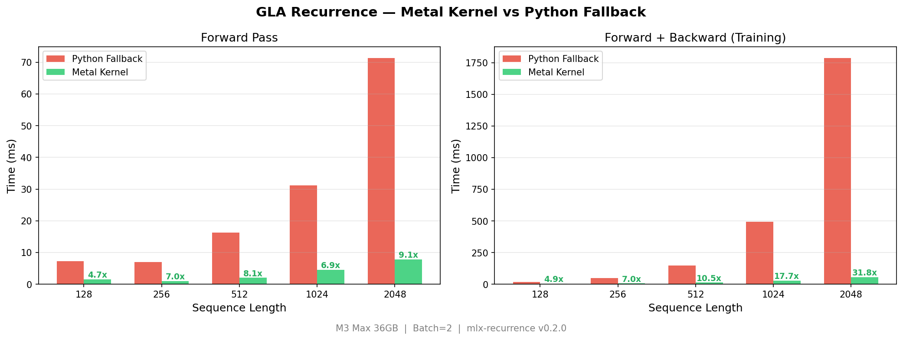

# mlx-recurrence

Fused Metal GPU kernels for SSM (selective scan) and GLA (gated linear attention)
linear recurrence on Apple Silicon. Built on top of [MLX](https://github.com/ml-explore/mlx).

These are believed to be the **first publicly available fused Metal kernels for linear
recurrence**, replacing Python-level for-loops (one Python→Metal dispatch per timestep)
with a single GPU kernel dispatch that runs the entire sequence on-device.

## Why this matters

State-space models (Mamba, S4) and gated linear attention models run a sequential
recurrence over sequence length L. In MLX the naive Python loop creates L
Python→Metal round trips — each adding dispatch overhead. With sequence lengths of
256–2048, this dominates total compute time.

`mlx-recurrence` collapses the entire recurrence into one kernel call per layer,
giving 6–7x wall-clock speedup on M-series hardware with numerically identical
outputs (max diff < 1e-4).

## Installation

```bash
pip install mlx-recurrence
```

Requires: Python >= 3.10, MLX >= 0.22.0, Apple Silicon Mac (Metal GPU).

## Usage

### SSM Selective Scan

```python
import mlx.core as mx
from mlx_recurrence import selective_scan_metal, selective_scan_chunked

B, L, D, N = 4, 256, 512, 64

u     = mx.random.normal((B, L, D))
delta = mx.abs(mx.random.normal((B, L, D))) * 0.1 + 0.01
B_in  = mx.random.normal((B, L, N))
C_in  = mx.random.normal((B, L, N))
A_neg = -mx.exp(mx.ones((D, N)))  # -exp(A_log), shape [D, N]

# Metal kernel (fastest, supports autograd via custom VJP)
y = selective_scan_metal(u, delta, B_in, C_in, A_neg)  # -> [B, L, D]

# Pure MLX chunked fallback (auto-differentiable, no Metal required)
y = selective_scan_chunked(u, delta, B_in, C_in, A_neg, chunk_size=32)
```

### GLA Recurrence

```python
from mlx_recurrence import gla_scan_metal, gla_scan_chunked

B, L, H, Dh = 4, 256, 8, 64

q     = mx.random.normal((B, L, H, Dh)) * (Dh ** -0.5)
k     = mx.random.normal((B, L, H, Dh))
v     = mx.random.normal((B, L, H, Dh))
gates = mx.sigmoid(mx.random.normal((B, L, H)))

# Metal kernel
output = gla_scan_metal(q, k, v, gates)     # -> [B, L, H, Dh]

# Chunked MLX fallback
output = gla_scan_chunked(q, k, v, gates)
```

Both `selective_scan_metal` and `gla_scan_metal` are fully differentiable via custom
VJPs — you can call `mx.grad()` on any loss that uses them.

## Benchmarks

Measured on M3 Max (36GB), batch size 2. Speedup scales with sequence length —
the Metal kernels stay nearly flat while the Python fallback grows linearly.

### SSM Selective Scan



### GLA Recurrence



### Summary (seq_len=2048)

| Pass | SSM Metal | SSM Python | Speedup | GLA Metal | GLA Python | Speedup |
|------|-----------|------------|---------|-----------|------------|---------|
| Forward | 10.8ms | 79.4ms | **7.3x** | 7.9ms | 71.3ms | **9.1x** |
| Forward + Backward | 64.5ms | 1,224.7ms | **19.0x** | 56.2ms | 1,786.7ms | **31.8x** |

The backward pass speedup is critical for training — without fused Metal kernels,
training SSM+GLA models on Apple Silicon is impractical at sequence lengths above 512.

Numerically identical outputs to the Python loop (max absolute difference < 1e-4).

Run benchmarks yourself:

```bash
python benchmarks/bench_chart.py    # generates PNG charts
python benchmarks/bench_scan.py     # text output
```

## Testing

```bash
pip install mlx-recurrence[dev]
pytest tests/
# or run directly:
python tests/test_kernels.py
```

Tests 1 and 2 (numerical and gradient correctness) are self-contained and run
without any other dependencies. Tests 3–5 require the `d_csil_1` model codebase
and will be automatically skipped if it is not present.

## Implementation Details

### SSM kernel

Each GPU thread handles one `(batch, feature_dim)` pair. The thread maintains the
`state_dim`-element hidden state `h[n]` in registers and loops over all `L` timesteps
entirely on-GPU. The backward pass runs the adjoint recurrence in a fused Metal kernel,
sweeping backward through timesteps with per-thread adjoint state in registers. The VJP
saves `h_all` from the forward pass to avoid re-running the forward kernel.

### GLA kernel

Each GPU thread handles one `(batch, head, j)` triple — one column of the `Dh x Dh`
state matrix. The thread maintains that column in registers, applies the gate decay,
accumulates the outer-product update, and dotproducts with queries for output. The
backward pass uses a matching fused Metal kernel for the adjoint recurrence, with
MLX parallel reductions for cross-dimension gradients (grad_q, grad_k, grad_gates).

### Chunked MLX fallback

Both `selective_scan_chunked` and `gla_scan_chunked` avoid Python-level loops using
a closed-form parallel prefix scan within each chunk of size `chunk_size`:

```
h[t] = P[t] * (h_prev + cumsum(inp / P))
where P[t] = exp(cumsum(log_decay))
```

This reduces Python overhead from O(L) to O(L / chunk_size) dispatches and is
fully auto-differentiable without a custom VJP.

## Citation

If you use mlx-recurrence in your work, please credit:

> Paul O. Derrington, Jr. — Derrington Collaborative Synthetic Intelligence Labs (D-CSIL)

## License

MIT License — Copyright (c) 2026 Paul O. Derrington, Jr.

Matches the MLX license. See [LICENSE](LICENSE).
